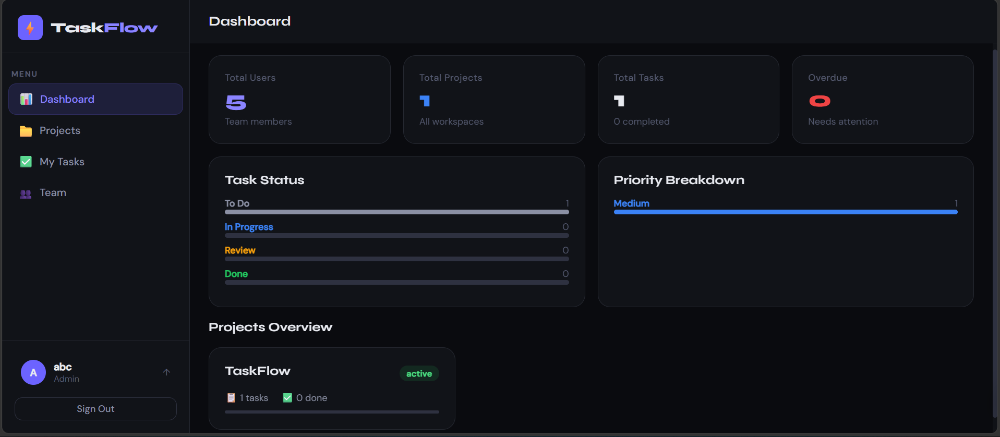
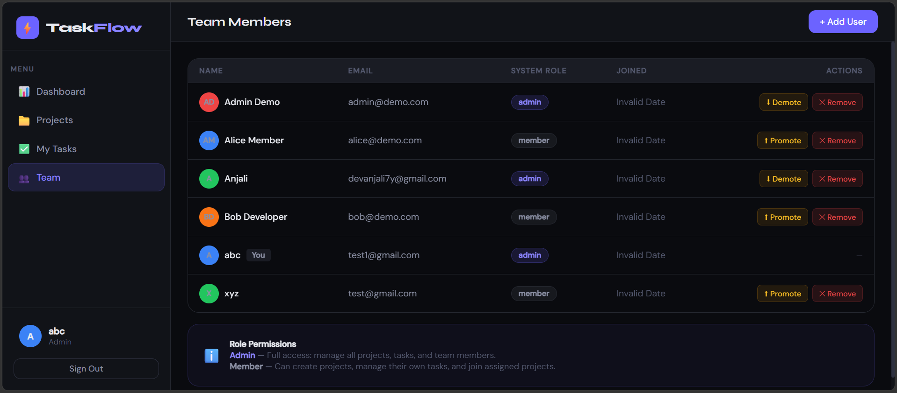

# 🚀 TaskFlow – Team Task Manager

A full-stack task management system designed for teams to collaborate efficiently with role-based access, project tracking, and real-time dashboard insights.

---

## 📸 Implementation

### 📊 Dashboard Overview

<p align="center">
  
</p>

The dashboard provides a quick summary of the system:

- **Total Users** → Number of team members in the workspace  
- **Total Projects** → Active projects being managed  
- **Total Tasks** → Tasks created across all projects  
- **Overdue** → Tasks that require immediate attention  

**Task Status Section:**
- **To Do** → Tasks not started yet  
- **In Progress** → Tasks currently being worked on  
- **Review** → Tasks pending approval or verification  
- **Done** → Completed tasks  

**Priority Breakdown:**
- Displays tasks grouped by priority level (Low, Medium, High)

---

### 👥 Team Management

<p align="center">
  
</p>

The Team page allows admins to manage users and roles:

- **Admin Role**  
  - Full access to projects, tasks, and team management  
  - Can promote or demote members  

- **Member Role**  
  - Can create and manage their own tasks  
  - Can participate in assigned projects  

**Actions Available:**
- **Promote** → Upgrade a member to admin  
- **Demote** → Change admin to member  
- **Remove** → Delete user from the team  

---

## 🔹 Features

* 🔐 JWT-based Authentication (Signup/Login)
* 👥 Role-Based Access Control (Admin / Member)
* 📁 Project Management APIs
* ✅ Task Creation & Tracking
* 📊 Dashboard Analytics (task stats, progress insights)
* ⚡ Lightweight SPA frontend (HTML, CSS, JS)
* 🚀 Ready for deployment on Railway

---

## 🔹 Tech Stack

**Frontend**

* HTML, CSS, JavaScript (Single Page Application)

**Backend**

* Node.js
* Express.js

**Database**

* SQLite (via sql.js)

**Authentication**

* JSON Web Tokens (JWT)

**Deployment**

* Railway

---

## 🔹 Project Structure

```
taskflow/
│
├── backend/
│   ├── db/
│   │   └── database.js
│   ├── middleware/
│   │   └── auth.js
│   ├── routes/
│   │   ├── auth.js
│   │   ├── projects.js
│   │   ├── tasks.js
│   │   └── dashboard.js
│   ├── server.js
│   └── package.json
│
├── frontend/
│   ├── public/
│   │   └── index.html
│
├── .env.example
├── railway.toml
├── package.json
└── .gitignore
```

---

## 🔹 Installation & Setup

```bash
# Clone repository
git clone <your-repo-url>

# Navigate to backend
cd taskflow/backend

# Install dependencies
npm install

# Setup environment variables
cp ../.env.example .env

# Start server
node server.js
```

---

## 🔹 Environment Variables

Create a `.env` file in `/backend`:

```
PORT=5000
JWT_SECRET=your_secret_key
```

---

## 🔹 API Endpoints

| Method | Route        | Description         |
| ------ | ------------ | ------------------- |
| POST   | /auth/signup | Register user       |
| POST   | /auth/login  | Login user          |
| GET    | /projects    | Fetch all projects  |
| POST   | /tasks       | Create a new task   |
| GET    | /dashboard   | Get dashboard stats |

---

## 🔹 Architecture Overview

* Modular backend structure with clear separation of concerns:

  * Routes handle API endpoints
  * Middleware manages authentication (JWT)
  * Database layer abstracts SQLite queries
* Stateless authentication using JWT tokens
* RESTful API design for scalability
* Frontend SPA consumes backend APIs via fetch

---

## 🔹 Deployment

* Configured using `railway.toml`
* Environment variables managed via Railway dashboard
* Backend deployed as a Node.js service

---

## 🔹 Future Improvements

* Refactor frontend into React (component-based architecture)
* Add real-time updates (WebSockets)
* Improve UI/UX (dashboard cards, sidebar, task filters)
* Add notifications and deadlines
* Migrate to MongoDB + Mongoose for scalability

---

## 🔹 Interview Summary

> "TaskFlow is a modular full-stack task management system built with Node.js and SQLite.
> It uses JWT-based authentication, role-based access control, and RESTful APIs.
> The frontend is a lightweight SPA, and the system is fully deployable on Railway."

---

## 📌 Author

Anjali Yadav